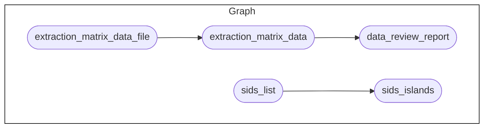

<!-- README.md is generated from README.Rmd. Please edit that file -->

# Seychelles Cancer Quality of Care Scoping Review <a href="https://www.tropicalmedicine.ox.ac.uk/study-with-us/msc-ihtm" target="_blank"></a> <a href="https://www.health.gov.sc/" target="_blank"></a>

<!-- badges: start -->

[-GPL3.0-blue.svg)](https://opensource.org/licenses/gpl-3.0.html)
[-CC_BY_4.0-blue)](https://creativecommons.org/licenses/by/4.0/)
[-CC0-blue)](https://creativecommons.org/public-domain/cc0/)
[](https://github.com/OxfordIHTM/sc-ca-qoc-review/actions/workflows/test-targets-workflow.yml)
[](https://doi.org/10.5281/zenodo.15825328)
<!-- badges: end -->

This repository is a template for a
[`docker`](https://www.docker.com/get-started)-containerised,
[`{targets}`](https://docs.ropensci.org/targets/)-based,
[`{renv}`](https://rstudio.github.io/renv/articles/renv.html)-enabled
[`R`](https://cran.r-project.org/) workflow for Seychelles cancer
quality of care scoping review.

<!-- 
## About the Project
 -->

## Repository Structure

The project repository is structured as follows:

    sc-ca-qoc-review
        |-- .github/
        |-- data/
        |-- data-raw/
        |-- outputs/
        |-- R/
        |-- renv
        |-- reports
        |-- _targets.R
        |-- .Rprofile
        |-- packages.R
        |-- renv.lock

  - `.github` contains project testing and automated deployment of
    outputs workflows via continuous integration and continuous
    deployment (CI/CD) using Github Actions.

  - `data/` contains intermediate and final data outputs produced by the
    workflow.

  - `data-raw/` contains raw datasets, usually either downloaded from
    source or added manually, that are used in the project.

  - `outputs/` contains compiled reports and figures produced by the
    workflow.

  - `R/` contains functions developed/created specifically for use in
    this workflow.

  - `renv/` contains `renv` package specific files and directories used
    by the package for maintaining R package dependencies within the
    project. The directory `renv/library`, is a library that contains
    all packages currently used by the project. This directory, and all
    files and sub-directories within it, are all generated and managed
    by the `renv` package. Users should not change/edit these manually.

  - `reports/` contains literate code for R Markdown and/or Quarto
    reports rendered in the workflow.

  - `_targets.R` file defines the steps in the workflow’s data ingest,
    data processing, data analysis, and reporting pipeline.

  - `.Rprofile` file is a project R profile generated when initiating
    `renv` for the first time. This file is run automatically every time
    R is run within this project, and `renv` uses it to configure the R
    session to use the `renv` project library.

  - `packages.R` file lists out all R package dependencies required by
    the workflow.

  - `renv.lock` file is the `renv` lockfile which records enough
    metadata about every package used in this project that it can be
    re-installed on a new machine. This file is generated by the `renv`
    package and should not be changed/edited manually.

## Reproducibility

### R version

This project was built using R 4.5.1. To manage R versions, it is
recommended to use [`rig`](https://github.com/r-lib/rig) - an R
installation manager - to be able to install multiple versions of R and
switch between them as needed.

### R package dependencies

This project uses the `{renv}` framework to record R package
dependencies and versions. Packages and versions used are recorded in
`renv.lock` and code used to manage dependencies is in the `renv`
directory and other files in the root project directory.

On starting an R session in the working directory of this repository,
first run

``` r
renv::restore()
```

to install R package dependencies.

### The workflow

The current workflow has the following steps:



To run the workflow, issue the following command in R from within the
project directory

``` r
targets::tar_make()
```

or issue the following command in Terminal from within the project
directory

``` bash
Rscript -e  "targets::tar_make()"
```

## Authors

  - Dr Nyasha Manyeruke - University of Oxford
  - Dr Johanna Rapanarilala - Oncology Unit, Ministry of Health,
    Seychelles
  - Dr Sylvie Pool - Ministry of Health, Seychelles and University of
    Oxford
  - Dr Ernest Guevarra - University of Oxford

## License

All code in this workflow is released under a
[GPL-3.0](https://www.gnu.org/licenses/gpl-3.0.en.html#license-text)
license. All text and reports in this workflow is released under a
[CC-BY-4.0](https://creativecommons.org/licenses/by/4.0/deed.en)
license. All data is released under a
[CC0](https://creativecommons.org/public-domain/cc0/) license.
